# Adversary Emulation & Detection Lab


**Student:** Azmul Hosen Titu  
**Roll:** 60027  
**Platform:** VMware / VirtualBox Host-Only Network Deployment  
**SIEM:** Splunk Enterprise on Kali Linux  
**Endpoint:** Windows Server 2019 with Sysmon Telemetry

## Project Overview

This repository documents an isolated blue-team lab for adversary emulation and detection engineering. Kali Linux is used as the control/SIEM node and Windows Server 2019 is used as the victim telemetry endpoint. Atomic Red Team tests are executed on the Windows host, logs are collected using Sysmon, forwarded with Splunk Universal Forwarder, and analyzed in Splunk Enterprise.

## Lab Architecture

| Component | Role | IP / Port |
|---|---|---|
| Kali Linux | Splunk Enterprise SIEM / Control Node | 192.168.56.101 |
| Windows Server 2019 | Victim / Telemetry Node | 192.168.56.110 |
| Splunk Receiving Port | Forwarder log ingestion | 9997 |
| Splunk Web UI | Search and dashboard | 8000 |

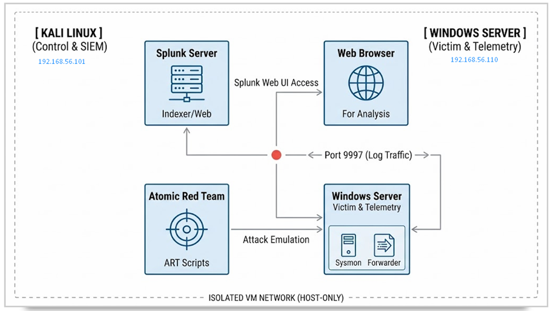

## Repository Structure

```text
.
├── README.md
├── LICENSE
├── .gitignore
├── docs/
│   ├── Adversary_Emulation_Detection_Lab_Report_with_screenshots.docx
│   └── Adversary_Emulation_Detection_Lab_Report_text_version.docx
├── screenshots/
│   └── 01-network-topology.png ... 33-t1112-detection.png
├── configs/
│   ├── inputs.conf
│   └── sysmonconfig.xml
└── splunk_queries/
    ├── T1053_005_Scheduled_Task.spl
    ├── T1218_005_MSHTA.spl
    ├── T1003_001_LSASS_ProcDump.spl
    ├── T1059_001_PowerShell_Download.spl
    └── T1112_Registry_Modification.spl
```

## Infrastructure Setup

| Virtual Machine | CPU | RAM | Network Adapter |
|---|---:|---:|---|
| Kali Linux Control Node | 2 cores | 4 GB minimum | Host-Only / NAT Shared |
| Windows Server 2019 Telemetry Victim | 2 cores | 4 GB minimum | Host-Only / NAT Shared |

## Splunk Enterprise Deployment

Splunk Enterprise was set up as the central ingestion repository on the Kali Linux virtual engine. After unpacking and running the daemon installation binaries, listening server rules were established to open network sockets. 


**Splunk Download -s1**

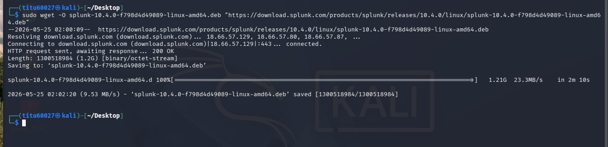

**Splunk installation** 

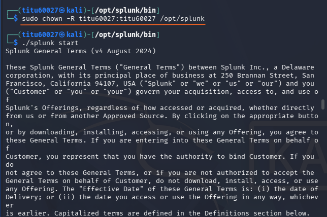

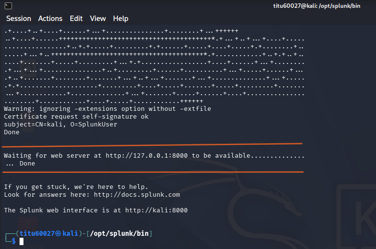

**Splunk Dashboard after successful installation**

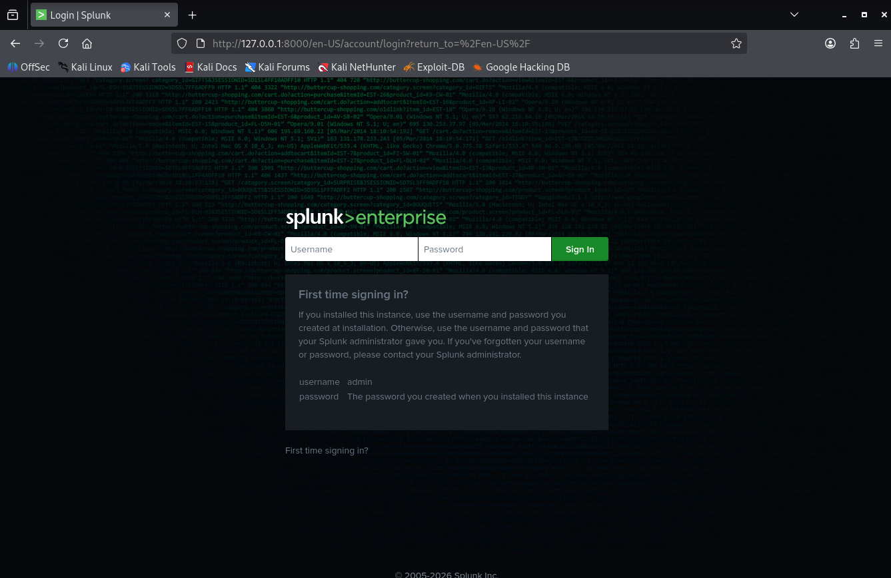

**Splunk dashboard after successful login**


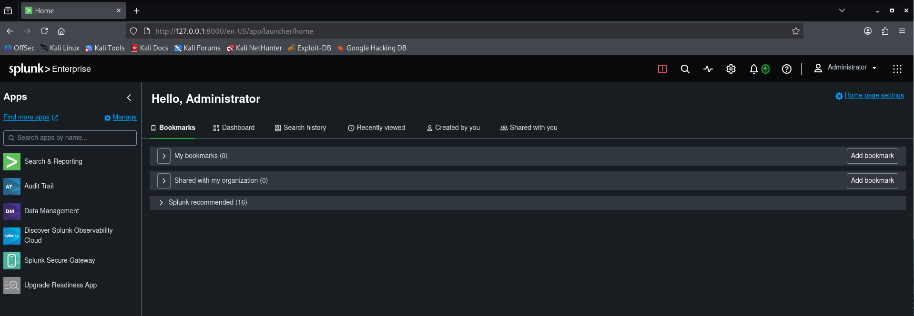

## Splunk Universal Setup

**Command to activate network listening pipelines on the Splunk instance on Kali linux**

```bash
./splunk enable listen 9997 -auth admin:password
```

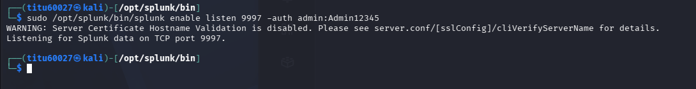

```text
Receiving Indexer: 192.168.56.101:9997
```

**Splunk Universal Forwarder Setup Victim PC**

Splunk Universal Forwarder was installed on Windows Server 2019 and configured to send logs to the Splunk server.


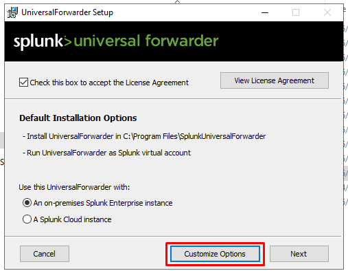

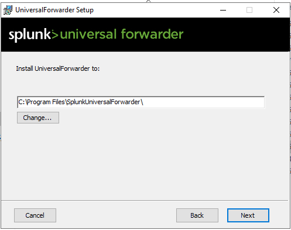

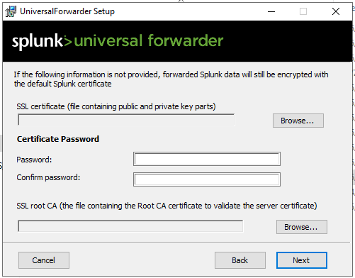

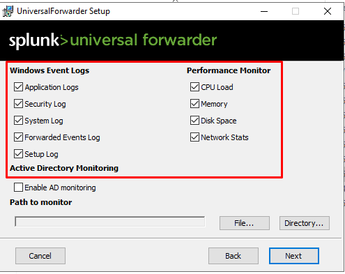

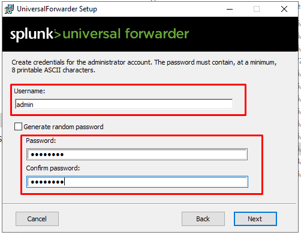

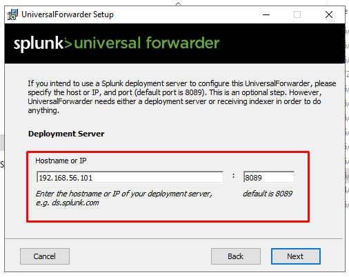

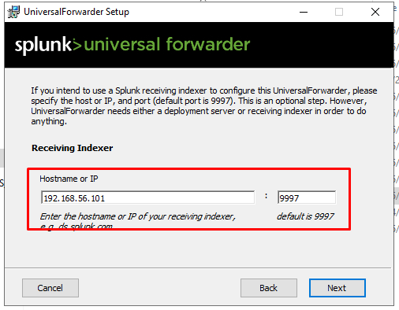

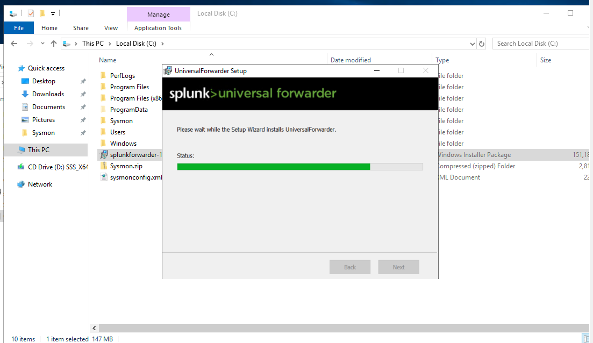

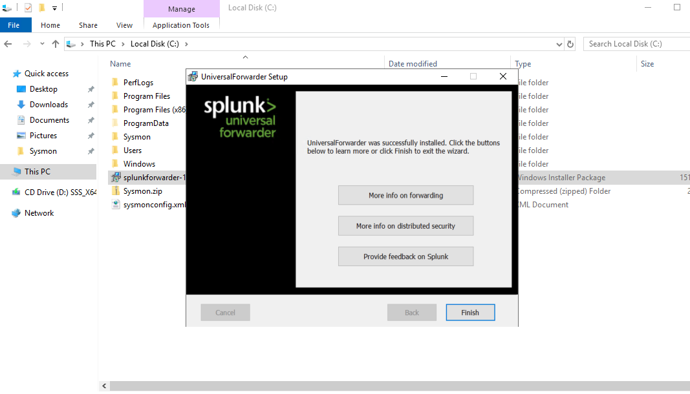

## Sysmon Setup

Sysmon was installed on the Windows endpoint to capture process creation, registry activity, process access, and other host telemetry.

```powershell
sysmon64.exe -i sysmonconfig.xml -accepteula
```

Forwarder input configuration:

```ini
[WinEventLog://Microsoft-Windows-Sysmon/Operational]
disabled = false
renderXml = true
index = main
```


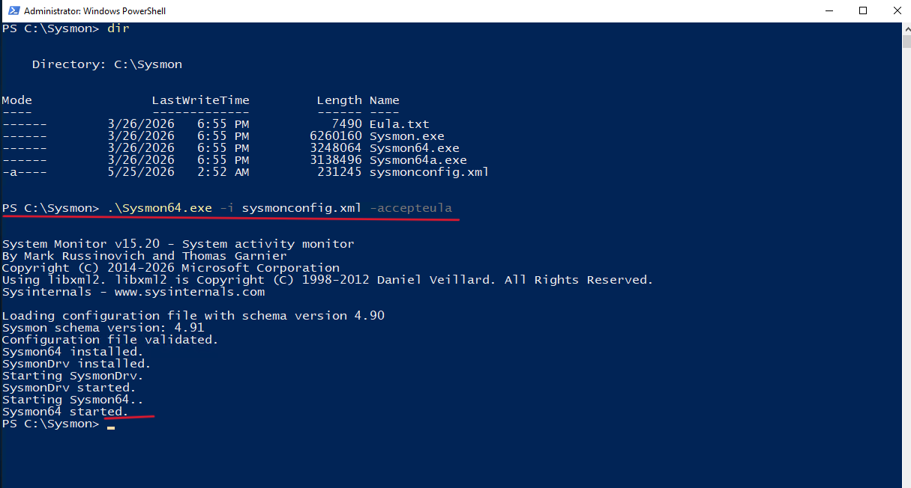

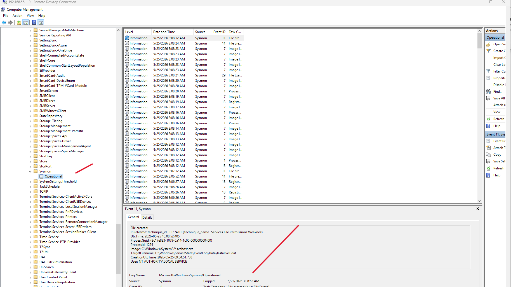

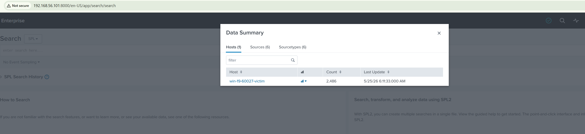

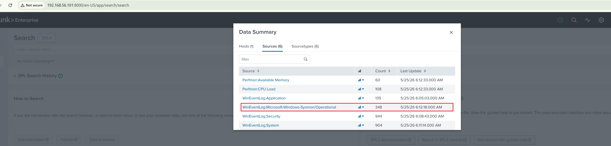

## Atomic Red Team Setup

Invoke-AtomicRedTeam was used to emulate adversary behavior safely inside the lab.

```powershell
Import-Module C:\AtomicRedTeam\invoke-atomicredteam\Invoke-AtomicRedTeam.psd1 -Force
$global:PathToAtomicsFolder = "C:\AtomicRedTeamtomics"
Add-MpPreference -ExclusionPath "C:\AtomicRedTeam"
```

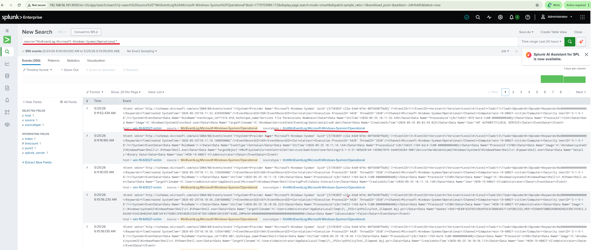

## MITRE ATT&CK Detection Coverage

| Technique ID | Technique | Tactic | Atomic Test | Detection Source |
|---|---|---|---|---|
| T1053.005 | Scheduled Task | Persistence | `Invoke-AtomicTest T1053.005 -TestNumbers 1` | Sysmon Event ID 1 |
| T1218.005 | MSHTA | Defense Evasion | `Invoke-AtomicTest T1218.005 -TestNumbers 1` | Sysmon Event ID 1 |
| T1003.001 | LSASS Dumping via ProcDump | Credential Access | `Invoke-AtomicTest T1003.001 -TestNumbers 1` | Sysmon Event ID 1 / Event ID 10 |
| T1059.001 | PowerShell | Execution | `Invoke-AtomicTest T1059.001 -TestNumbers 1` | Sysmon Event ID 1 |
| T1112 | Registry Modification | Defense Evasion / Persistence | `Invoke-AtomicTest T1112 -TestNumbers 2` | Sysmon Event ID 1 / Event ID 13 |

## Detection Queries

All SPL queries are stored in the [`splunk_queries`](./splunk_queries/) folder.

### T1053.005 - Scheduled Task

```powershell
Invoke-AtomicTest T1053.005 -TestNumbers 1
```

```spl
index=main sourcetype="XmlWinEventLog:Microsoft-Windows-Sysmon/Operational" "schtasks.exe"
| rex field=_raw "<EventID>(?<Event_ID>\d+)</EventID>"
| rex field=_raw "<Data Name='Image'>(?<Process_Name>[^<]+)</Data>"
| rex field=_raw "<Data Name='CommandLine'>(?<Command_Line>[^<]+)</Data>"
| search Event_ID=1
| table _time, host, Event_ID, Process_Name, Command_Line
```

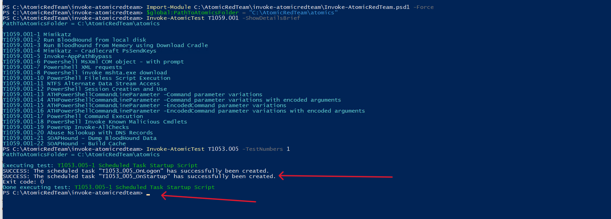

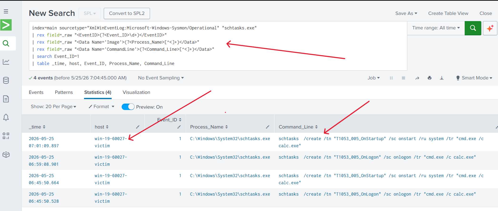

### T1218.005 - MSHTA Execution

```powershell
Invoke-AtomicTest T1218.005 -TestNumbers 1
```

```spl
index=main sourcetype="XmlWinEventLog:Microsoft-Windows-Sysmon/Operational" "mshta.exe"
| rex field=_raw "<EventID>(?<Event_ID>\d+)</EventID>"
| rex field=_raw "<Data Name='Image'>(?<Process_Name>[^<]+)</Data>"
| rex field=_raw "<Data Name='CommandLine'>(?<Command_Line>[^<]+)</Data>"
| search Event_ID=1
| table _time, host, Event_ID, Process_Name, Command_Line
```

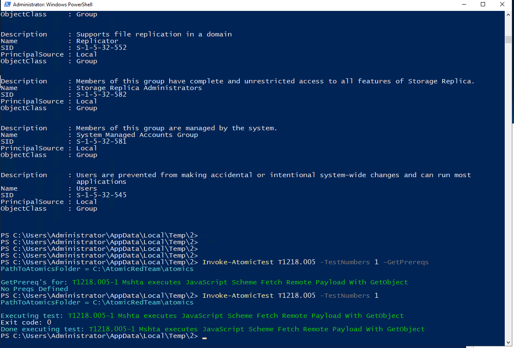

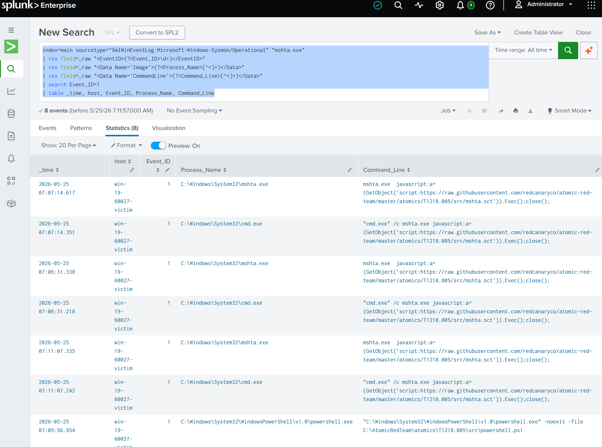

### T1003.001 - LSASS Dumping via ProcDump

```powershell
Invoke-AtomicTest T1003.001 -TestNumbers 1
```

```spl
index=main sourcetype="XmlWinEventLog:Microsoft-Windows-Sysmon/Operational" "procdump"
| rex field=_raw "<EventID>(?<Event_ID>\d+)</EventID>"
| rex field=_raw "<Data Name='Image'>(?<Process_Name>[^<]+)</Data>"
| rex field=_raw "<Data Name='CommandLine'>(?<Command_Line>[^<]+)</Data>"
| search Event_ID=1
| table _time, host, Event_ID, Process_Name, Command_Line
```

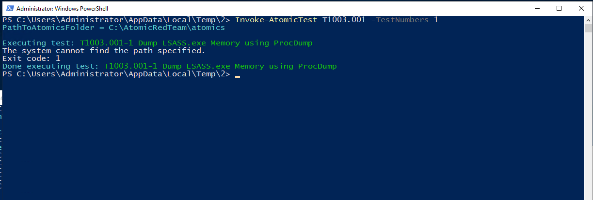

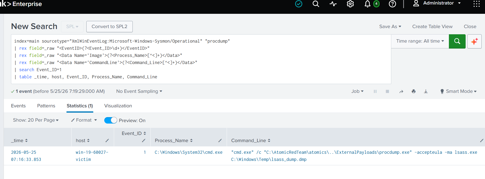

### T1059.001 - PowerShell Download Activity

```powershell
Invoke-AtomicTest T1059.001 -TestNumbers 1
```

```spl
index=main sourcetype="XmlWinEventLog:Microsoft-Windows-Sysmon/Operational" "powershell.exe"
| rex field=_raw "<EventID>(?<Event_ID>\d+)</EventID>"
| rex field=_raw "<Data Name='Image'>(?<Process_Name>[^<]+)</Data>"
| rex field=_raw "<Data Name='CommandLine'>(?<Command_Line>[^<]+)</Data>"
| search Event_ID=1 (Command_Line="*DownloadString*" OR Command_Line="*Invoke-WebRequest*" OR Command_Line="*iwr*")
| table _time, host, Event_ID, Process_Name, Command_Line
```

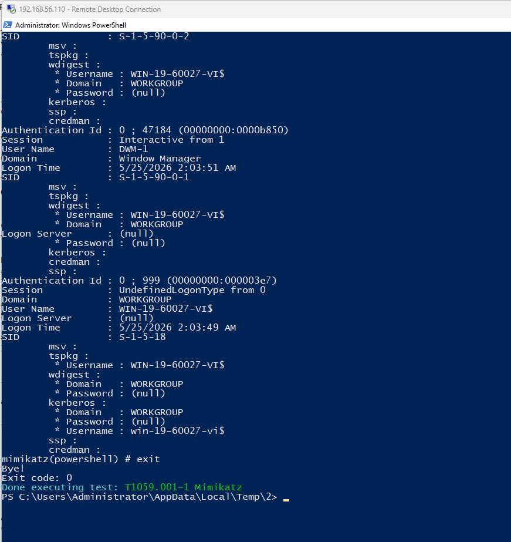

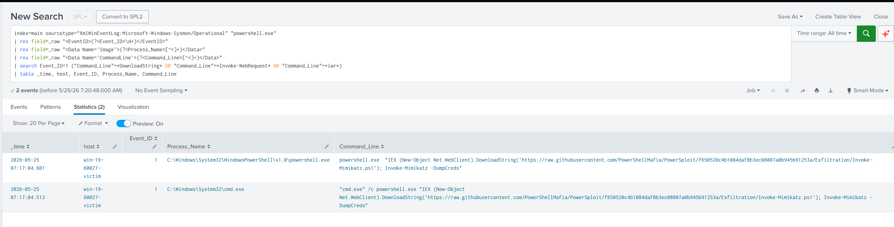

### T1112 - Registry Modification

```powershell
Invoke-AtomicTest T1112 -TestNumbers 2
```

```spl
index=main sourcetype="XmlWinEventLog:Microsoft-Windows-Sysmon/Operational" "reg.exe"
| rex field=_raw "<EventID>(?<Event_ID>\d+)</EventID>"
| rex field=_raw "<Data Name='Image'>(?<Process_Name>[^<]+)</Data>"
| rex field=_raw "<Data Name='CommandLine'>(?<Command_Line>[^<]+)</Data>"
| search Event_ID=1
| table _time, host, Event_ID, Process_Name, Command_Line
```

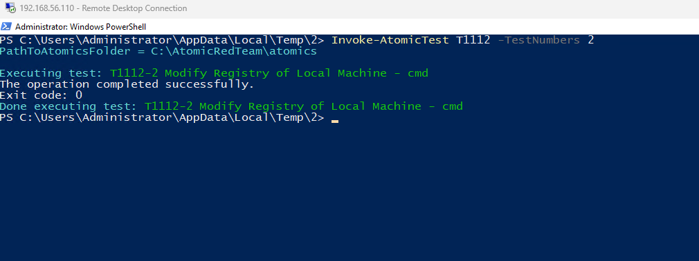

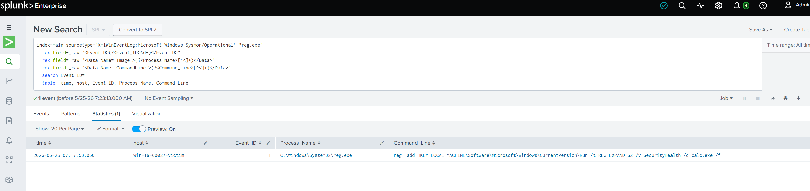

## All Screenshots

| No. | Screenshot |
|---:|---|
| 01 | [Network Topology](./screenshots/01-network-topology.png) |
| 02 | [Splunk Download](./screenshots/02-splunk-download.png) |
| 03 | [Splunk Start Terminal](./screenshots/03-splunk-start-terminal.png) |
| 04 | [Splunk Login Page](./screenshots/04-splunk-login-page.png) |
| 05 | [Splunk Dashboard](./screenshots/05-splunk-dashboard.png) |
| 06 | [Splunk Listen 9997](./screenshots/06-splunk-listen-9997.png) |
| 07 | [Forwarder Installer Start](./screenshots/07-forwarder-installer-start.png) |
| 08 | [Forwarder Install Path](./screenshots/08-forwarder-install-path.png) |
| 09 | [Forwarder SSL Page](./screenshots/09-forwarder-ssl-page.png) |
| 10 | [Forwarder Event Logs](./screenshots/10-forwarder-event-logs.png) |
| 11 | [Forwarder Admin Credentials](./screenshots/11-forwarder-admin-credentials.png) |
| 12 | [Forwarder Deployment Server](./screenshots/12-forwarder-deployment-server.png) |
| 13 | [Forwarder Receiving Indexer](./screenshots/13-forwarder-receiving-indexer.png) |
| 14 | [Forwarder Installing](./screenshots/14-forwarder-installing.png) |
| 15 | [Forwarder Installed](./screenshots/15-forwarder-installed.png) |
| 16 | [Sysmon Directory](./screenshots/16-sysmon-directory.png) |
| 17 | [Sysmon Event Viewer](./screenshots/17-sysmon-event-viewer.png) |
| 18 | [inputs.conf Sysmon](./screenshots/18-inputs-conf-sysmon.png) |
| 19 | [Splunk Data Summary](./screenshots/19-splunk-data-summary.png) |
| 20 | [Splunk Sourcetypes](./screenshots/20-splunk-sourcetypes.png) |
| 21 | [Sysmon Log Search Verification](./screenshots/21-sysmon-log-search-verification.png) |
| 22 | [Atomic Red Team Setup](./screenshots/22-atomicredteam-setup.png) |
| 23 | [T1053 Execution](./screenshots/23-t1053-execution.png) |
| 24 | [T1053 Calc Proof](./screenshots/24-t1053-calc-proof.png) |
| 25 | [T1053 Detection](./screenshots/25-t1053-detection.png) |
| 26 | [T1218 Execution](./screenshots/26-t1218-execution.png) |
| 27 | [T1218 Detection](./screenshots/27-t1218-detection.png) |
| 28 | [T1003 Execution](./screenshots/28-t1003-execution.png) |
| 29 | [T1003 Detection](./screenshots/29-t1003-detection.png) |
| 30 | [T1059 Execution](./screenshots/30-t1059-execution.png) |
| 31 | [T1059 Detection](./screenshots/31-t1059-detection.png) |
| 32 | [T1112 Execution](./screenshots/32-t1112-execution.png) |
| 33 | [T1112 Detection](./screenshots/33-t1112-detection.png) |

## Key Findings

- Sysmon Event ID 1 was the primary data source for process creation visibility.
- Scheduled task creation was detected through `schtasks.exe` command-line telemetry.
- MSHTA abuse was detected through `mshta.exe` execution and inline JavaScript indicators.
- ProcDump activity was detected by looking for `procdump` execution and LSASS-related command arguments.
- PowerShell download activity was detected through suspicious command-line strings such as `DownloadString`, `Invoke-WebRequest`, and `iwr`.
- Registry modification activity was detected through `reg.exe` command-line execution.

## Lessons Learned

This project demonstrates how adversary emulation can be combined with endpoint telemetry and SIEM analysis to build practical blue-team detection logic. It also shows the importance of command-line logging, Sysmon configuration, and mapping detections to MITRE ATT&CK techniques.

## Disclaimer

This project is for academic and defensive cybersecurity learning only. All tests should be performed only in an isolated lab environment that you own or have permission to use.
